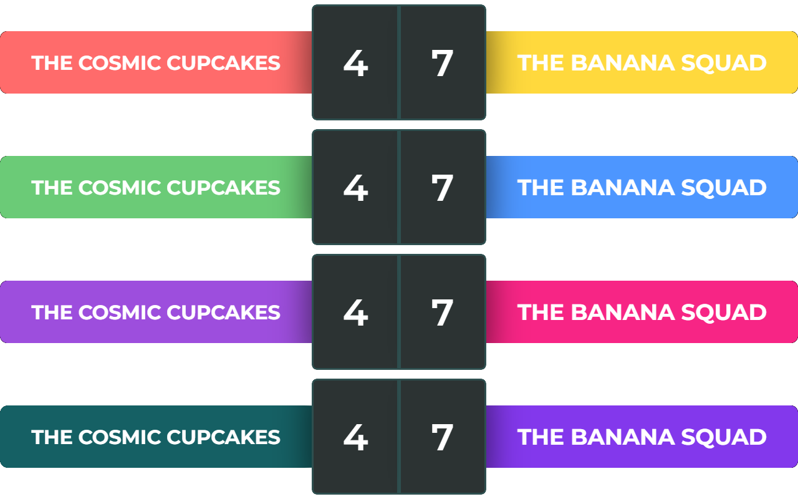

# VersusUI

  
  
  
  
  

### [📜README English](README.md)

**VersusUI** è un componente overlay React elegante e personalizzabile, pensato per streaming e registrazioni competitive. Ti permette di mostrare i nomi di giocatori o squadre insieme a un contatore del punteggio in tempo reale — perfetto per partite 1v1, tornei o qualsiasi contenuto testa-a-testa.

🔗 [Apri VersusUI](https://moreee-sa.github.io/VersusUI/)

- [VersusUI](#versusui)
    - [📜README English](#readme-english)
  - [✨ Caratteristiche](#-caratteristiche)
  - [📸 Screenshot](#-screenshot)
  - [🎨 Include 4 Palette di Colori](#-include-4-palette-di-colori)
- [Come Usarlo](#come-usarlo)
  - [✏️ Modifica Nomi Squadre/Giocatori](#️-modifica-nomi-squadregiocatori)
  - [⚙️ Controlla il Punteggio](#️-controlla-il-punteggio)
  - [🎨 Seleziona una Palette di Colori](#-seleziona-una-palette-di-colori)
  - [🖥️ Uso con OBS](#️-uso-con-obs)
  - [🚀 In Arrivo](#-in-arrivo)

## ✨ Caratteristiche
- 📺 UI pulita e reattiva per OBS o qualsiasi software di streaming
- 📝 Nomi di squadre/giocatori modificabili
- 🔢 Contatori del punteggio in tempo reale
- 🎨 Facile da personalizzare con temi
- ⚛️ Realizzato con React e pratiche moderne di frontend

## 📸 Screenshot

Il layout predefinito e pulito di **VersusUI** – perfetto per ogni streaming competitivo! 🎮✨

Personalizza facilmente nomi delle squadre e punteggi! 🎯 Inoltre, il testo è ridimensionabile per una visibilità perfetta. 🔥

## 🎨 Include 4 Palette di Colori
Passa rapidamente tra 4 temi colore integrati usando i tasti da 1 a 4 sulla tastiera, oppure premi 0 per tornare al tema predefinito. 🖌️🎉

**Altre palette in arrivo!**

# Come Usarlo

## ✏️ Modifica Nomi Squadre/Giocatori
- **Clicca sul nome della squadra** direttamente nell'overlay.
- Puoi **scrivere il nome della squadra o del giocatore**, con un massimo di **30 caratteri**.

## ⚙️ Controlla il Punteggio
- Per **aumentare il punteggio**, fai **clic sinistro** sul contatore.
- Per **diminuire il punteggio**, fai **clic destro** sul contatore.
- Ora puoi anche scorrere verso l'alto con la rotella del mouse per aumentare e scorrere verso il basso per diminuire il punteggio.

## 🎨 Seleziona una Palette di Colori
- Puoi **selezionare una palette di colori** premendo i tasti **da 1 a 4** sulla tastiera.
- Premi **0** per tornare alla **palette predefinita**.

## 🖥️ Uso con OBS
1. Aggiungi come sorgente Browser in OBS
2. **Copia il link URL** di [VersusUI](https://moreee-sa.github.io/VersusUI/).
3. In OBS, **aggiungi una nuova sorgente** di tipo **"Browser"**.
4. **Incolla l’URL** copiato nel campo URL della sorgente Browser.
5. **Imposta la risoluzione** della sorgente su **1280x200px** per adattarla correttamente al layout.
6. Per interagire con l’overlay (es. scrivere nomi delle squadre), fai clic destro sulla sorgente Browser in OBS e seleziona **"Interagisci"**. Questo aprirà una finestra interattiva dove puoi scrivere o cliccare come necessario. 🖱️⌨️

## 🚀 In Arrivo
- Scorciatoie da tastiera per controllare il punteggio

---

Rimani aggiornato per le novità!