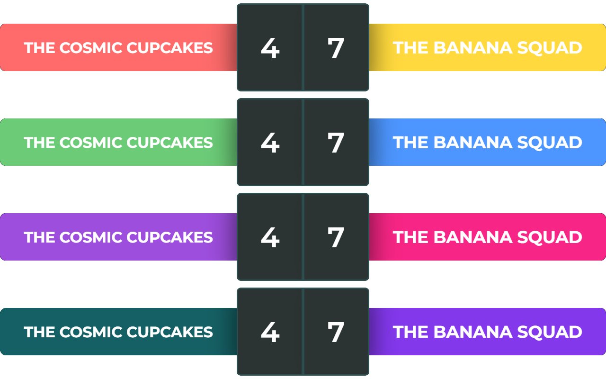

# VersusUI

  
  
  
  
  

### [📜README Italiano](README.it.md)

**VersusUI** is a sleek and customizable React overlay component designed for competitive streams and recordings. It allows you to display player or team names alongside a live-updating score counter, perfect for 1v1 matches, tournaments, or any head-to-head content.

🔗 [Open VersusUI](https://moreee-sa.github.io/VersusUI/)

- [VersusUI](#versusui)
    - [📜README Italiano](#readme-italiano)
  - [✨ Features](#-features)
  - [📸 Screenshot](#-screenshot)
  - [🎨 Includes 4 Color Palettes](#-includes-4-color-palettes)
- [How to Use](#how-to-use)
  - [✏️ Edit Team/Player Names](#️-edit-teamplayer-names)
  - [⚙️ Control the Score](#️-control-the-score)
  - [🎨 Select Color Palette](#-select-color-palette)
  - [🖥️ How to Use for OBS](#️-how-to-use-for-obs)
  - [🚀 Coming Soon](#-coming-soon)

## ✨ Features
- 📺 Clean and responsive UI for OBS or any streaming software
- 📝 Editable player/team names
- 🔢 Real-time score counters
- 🎨 Easy to style and theme
- ⚛️ Built with React + modern frontend practices

## 📸 Screenshot

The clean, default layout of **VersusUI** – perfect for any competitive stream! 🎮✨

Customize team names and scores easily! 🎯 Plus, text is resizable for perfect visibility. 🔥

## 🎨 Includes 4 Color Palettes
Quickly switch between 4 built-in color themes using keys 1–4 on your keyboard, or press 0 to reset to the default. 🖌️🎉

**More palettes coming soon!**

# How to Use

## ✏️ Edit Team/Player Names
- **Click on the team name** directly in the overlay.
- You can **type the team or player name**, with a maximum of **30 characters**.

## ⚙️ Control the Score
- To **increase the score**, **left-click** on the score counter.
- To **decrease the score**, **right-click** on the score counter.

## 🎨 Select Color Palette
- You can **select a color palette** by pressing the keys **1 to 4** on your keyboard.
- Press **0** to return to the **default color palette**.

##  🖥️ How to Use for OBS
1. Add as a Browser Source in OBS
2. **Copy the URL link** of your hosted **VersusUI** component URL.
3. In OBS, **add a new source** of type **"Browser"**.
4. **Paste the URL** you copied into the URL field of the Browser Source.
5. **Set the resolution** of the source to **1280x200px** to fit the layout properly.
6. To interact with the overlay (e.g., type team names), right-click the Browser Source in OBS and select **"Interact"**. This opens an interactive window where you can type or click as needed. 🖱️⌨️

## 🚀 Coming Soon
- Keyboard shortcuts for score control

---

Stay tuned for updates!